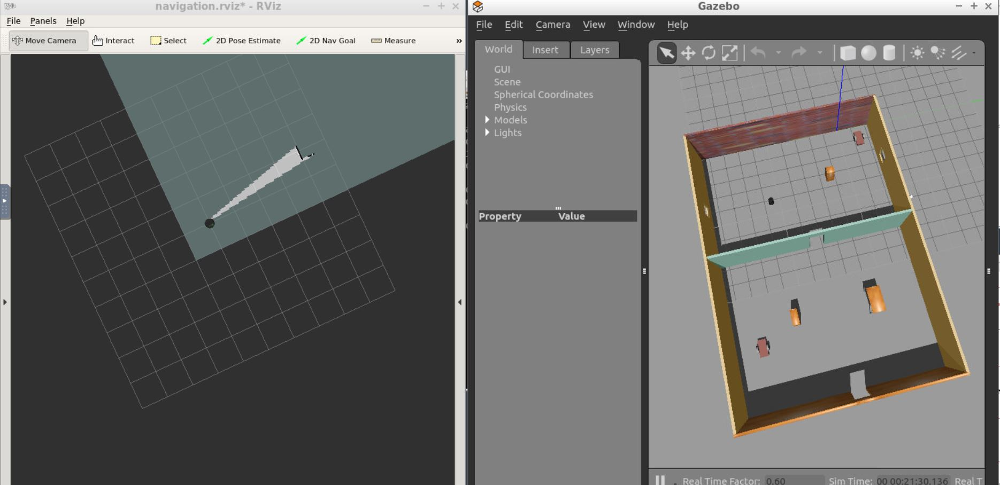
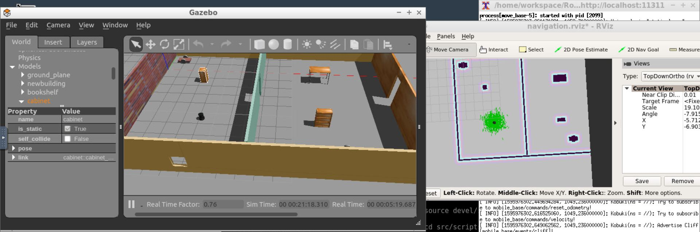

# RoboND-HomeServiceRobot
This is the final project of Udacity Nano Degree Program Robotics Software Engineer. 

## Final Output:

## Implementation:

The algorithm is implemeted as follows:

 1. The Marker(virtual object) is shown at the pick up zone.
 2. Navigate the robot to the pick up location.
 3. Wait for 5 sec as the marker disappears (indicates picking up of virtual object) 
 4. Robot moves to the drop location.
 5. Wait for 5 sec as the marker reappears at drop off location, which indicates the dropping of the virtual object.

## Initial Steps:

Firstly, upgrade the system using the following command:

		sudo apt-get update && apt-get upgrade
    
## Shell Scripts
   Create a 'scripts' folder in the src directory. This folder contains the following files:
   
  
   1. launch.sh
   
         This script will open the first terminal and launch gazebo. Then it will pause for 5 seconds and open a second terminal to launch the ROS master. It will pause for another 5 seconds and, finally, open a third terminal to launch RVIZ.

The commands in this file is executed by:

		chmod +x launch.sh
		./launch.sh
     
   2. test_slam.sh
   
         The goal of this step is to manually test SLAM. This script will deploy a turtlebot inside our environment, control it with keyboard commands, interface it with a SLAM package, and visualize the map in rviz.
          
         execution of this shell script is similar to that of launch.sh file we seen ealier.
    
   3. test_navigation.sh
   
         This shell script is used to launch Gazebo, rviz and Adaptive MCL. The objective is to pick two different goals and test our robot's ability to reach them and orient itself with respect to them. We will refer to these goals as the pickup and drop off zones. 
            
   4. pick_objects.sh
   
         This shell script is used to launch Gazebo, rviz, amcl and an additional node named 'pick_objects'. This node will communicate with the ROS navigation stack and autonomously send successive goals for our robot to reach the pick up location.            
     
   5. add_markers.sh
   
         Gazebo, rviz, amcl and add_markers node are launched using this script file. This node is used to model a virtual object with markers in rviz. The virtual object is the one being picked and delivered by the robot, thus it should first appear in its pickup zone, and then in its drop off zone once the robot reaches it.
            
   6. home_service.sh
   
         This involves all the nodes in a single shell script namely, Gazebo, rviz, amcl and add_markers. The robot moves towards the marker and after 5 sec of reaching that location, the marker disappears indicating that the virtual object has been picked up. Then, the robot moves to the drop of location and after 5 sec of arrival the marker appears at that location, indicating that the object has been dropped off there.
            
                       
## Installation of Packages:

The following packages are installed using the link provided in the tutorial.

   1. gmapping
   
         With the gmapping_demo.launch file, we can easily perform SLAM and build a map of the environment with a robot equipped with laser range finder sensors or RGB-D cameras.
           
   2. turtlebot_teleop
   
         With the keyboard_teleop.launch file, we can manually control a robot using keyboard commands.
           
   3. turtlebot_rviz_launchers
   
         With the view_navigation.launch file, we can load a preconfigured rviz workspace. We will save a lot of time by launching this file, because it will automatically load the robot model, trajectories, and map.
           
   4. turtlebot_gazebo
   
         With the turtlebot_world.launch we can deploy a turtlebot in a gazebo environment by linking the world file to it.

## Creating Packages (pick_objects and add_markers):

Packages for picking virtual objects and marking them are created using the following command:

		catkin_create_pkg <packagename>

## Pick_objects:
   
   A pick up goal will be sent to the ROS navigation stack to pick up the virtual object (sphere) from the given location. Then, the robot travels to that partcular cordinate for picking up the object. A message is already stored in the program which displays the user that the robot has reached that particular position to pick up the found object.
   
   Similarly, a drop goal will be sent to the ROS navigation stack to drop the object at a partcular location. A drop of message will be then shown to user which acknowledges the arrival in the drop zone.
   
   On the other hand, an error message will be shown if the robot fails to reach pick/drop zones  

Steps:
 1. Create pick_objects package using the catkin command (explained in the previous section)
 2. Add pick_object.cpp node and edit it as instructed in the tutorial.
 3. Edit CMakeLists.txt file to add directories, executables and target link libraries.
 4. Build the catkin ws.
 
 ## Add_markers:
 
   A sphere is modelled and it is defined as a virtual object in rviz. This virtual object appears as a marker in the pick up position. When the robot arrives at this location, a command is executed to delete the marker after 5 sec to indicate the picking up of object.
   
   Similarly at the drop of location, a command will be executed to add the marker after 5 sec of arrival. This indicates dropping of the virtual object at the drop of location.
   
   In both cases, a corresponding message will be shown to the user whether it succesfully performed the task . 
 
 Steps:
 1. Create add_markers package using the catkin command (explained in the previous section)
 2. Add add_markers.cpp node and edit it as instructed in the tutorial.
 3. Edit CMakeLists.txt file to add directories, executables and target link libraries.
 4. Build the catkin ws.
 
 
## Mapping

   Simultaneous Localization and Mapping (SLAM) is used to generate the map of environment. This is a two dimensional grid map is produced using data obtained from laser sensors. The obtained map is as of given below:

       
        
## Localization
        
       
  Localization is performed using amcl(adaptive monte carlo localization) algorithm, where the particles converges to the actual position of the robot as it navigates. The resampling of particles are based on the particle weights so that only the particles very near to the actual position of robot will survive.
 
 
  
## Navigation
        
   We will be using the ROS Navigation stack, which is based on the Dijkstra's, a variant of the Uniform Cost Search algorithm, to plan our robot trajectory from start to goal position. The ROS navigation stack permits our robot to avoid any obstacle on its path by re-planning a new trajectory once our robot encounters them. 
  
